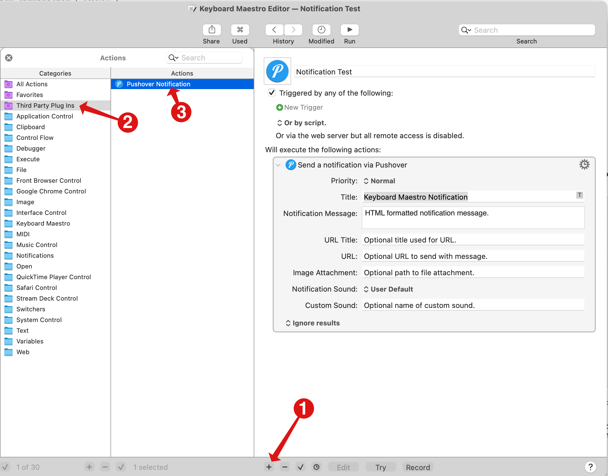

# Keyboard-Maestro-Pushover-Notifications

This is a [Keyboard Maestro](http://www.keyboardmaestro.com) [plug-in action](https://wiki.keyboardmaestro.com/manual/Plug_In_Actions)
to allow Keyboard Maestro to send notifications via the [Pushover](https://pushover.net)
notifications service.

Before using you must have a Pushover account and create an API application token. See
Pushover's documentation on [registering an application](https://pushover.net/api#registration) for
information on creating an application token.

## Installation
- Browse to the folder "~/Library/Application Support/Keyboard Maestro/Keyboard Maestro Actions"
	- If it does not already exist, create it
- Create the folder "Pushover Notifications" in the Keyboard Maestro Actions folder
- Copy the files into the folder
- _Edit the PushoverNotification.scpt file_
- Insert your Pushover User Key where indicated in the line (between the quote marks):

        set PO_UserKey to "INSERT_USER_KEY_HERE"

- Insert your Pushover Application API Key where indicated in the line (between the quote marks):

        set PO_UserKey to "INSERT_API_TOKEN_HERE"

## Upgrading
- Copy your current User Key and API Token from the current PushoverNotification.scpt Applescript
- Overwrite all the files in the Keyboard Maestro Actions/Pushover Notifications folder
- __Edit the PushoverNotification.scpt file__
- Insert your Pushover User Key where indicated in the line (between the quote marks):

        set PO_UserKey to "INSERT_USER_KEY_HERE"

- Insert your Pushover Application API Key where indicated in the line (between the quote marks):

        set PO_UserKey to "INSERT_API_TOKEN_HERE"

- Reload both Keyboard Maestro and the Keyboard Maestro engine.
	- either by quitting/relaunching them or using Applescript:

```	
	tell application "Keyboard Maestro" to reload
	tell application "Keyboard Maestro Engine" to reload
```

## Usage

After installing the Pushover Notification plug-in you can add a notification action
to a new or existing macro by:
1. Click the Add Action button
2. Click the Third Party Plug Ins folder in the action picker.
3. Double-click, or drag, the Pushover Notification action to your macro.
4. Fill in the fields as desired
	- Optional fields you don't use can be left with their default values or have no content.
5. HTML content in the Notification message supports a limited set of HTML functions.
		- See [Pushover's HTML Styling notes](https://pushover.net/api#html) for more info.
6. Pathing for the Image Attachment:
	- Use Unix style paths
	- Paths beginning with ~/ will have the ~/ replaced with the path to your home folder.
	- File must exist and only have an extension of jpg, jpeg, png or gif.
	- File must be under 2,621,440 bytes
7. Custom Sounds:
	- Before using a custom sound, the MP3 of the sound must be uploaded to your Pushover account and given a name
	- Use the name assigned to the sound in the Custom Sound field
	- If both a standard Notification Sound and a Custom Sound are specified, the Custom Sound is used.



## Known Issues
- Sending messages in plain text instead of HTML not supported.
- Setting a custom time not supported.

## Thanks
- Thanks to GitHub user [trych](https://github.com/trych) for fixing a bunch of stuff a long time ago and letting people on the Keyboard Maestro forum know about it.

## Change Log
- 2021-05-31
	- Fixed issue in retrieving multi-line Keyboard Maestro variables. Changed from using do shell script "echo $KMPARAM_xxx" to do shell script "printenv KMPARAM_xxx"
- 2021-05-30
	- Changed URL entry to Keyboard Maestro "TokenString" so it appears in UI as a single line instead of multi-line text.
	- Added support for Pushover custom sounds. Upload a custom sound to Pushover, then use it here.
		- See: [Pushover's Blog on Custom Sounds](https://blog.pushover.net/posts/2021/3/custom-sounds)
	- Fixed issue if optional entries were shorter than the default value returned from Keyboard Maestro
		- Applescript will error out on "text 1 thru 14 of stringValue" if stringValue is shorter than 14 characters
		- fix by using "text 1 thru end of stringValue"
	- Fixed issue where double-quotes or backtics in a field caused incomplete notification to be sent.
	- Added new(ish) sound selection "Vibrate"
	- Fixed issue where sound selection wouldn't work if not in lower case and no spaces
		- Also "Pushover Echo" is just "echo" in the API and "Alien Alarm" is just "alien"
		- thanks to trych for fixing this years ago on their [GitHub](https://github.com/trych/Keyboard-Maestro-Pushover-Notifications)
	- Added support for image attachments
		- Again thanks to trych for fixing this years ago.
		- Image attachment paths can use unix style "~/" as a shortcut for the home folder
		- Extended trych's code by adding limits on attaching files:
			- Make sure the file exists and is passed on the command line in an appropriate quoted fashion
			- Pushover specifically only allows image attachments so this restricts to files with extensions jpg, jpeg, png, and gif.
			- Max file size allowed is (as of 2021-05-30) 2,621,440 bytes
		- **NOTE:** Because this code actually examines the file size and file extension of the file you may trigger macOS privacy protections
		  and be asked to approve access to the file location. If you don't attach files, this security notice won't trigger.
	- Fixed issue where emoji and international characters would not work properly

